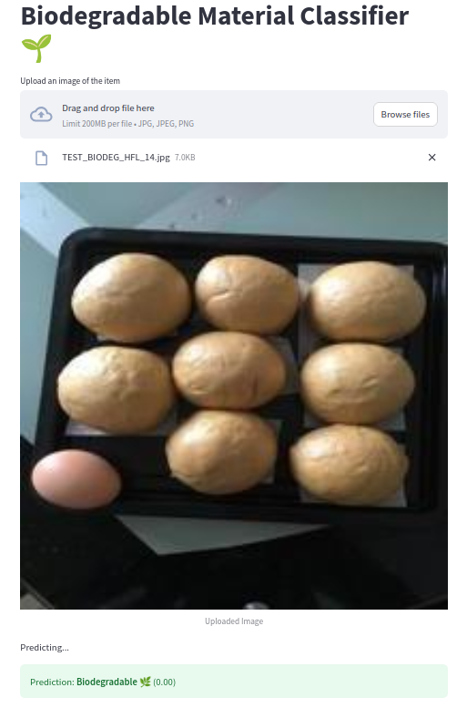
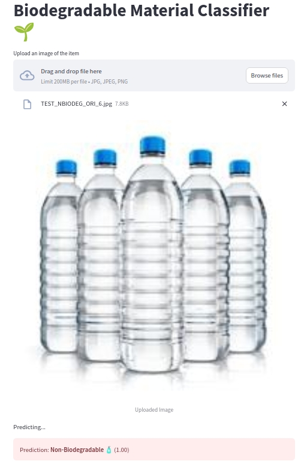

# Biodegradable vs Non-Biodegradable Waste Classification using ResNet50

## Overview

This project implements a deep learning model based on **ResNet50** architecture to classify waste images into **biodegradable** and **non-biodegradable** categories. The model leverages transfer learning on a labeled waste image dataset to automate waste segregation, which is crucial for effective recycling and environmental sustainability.

## Motivation

Manual waste sorting is hazardous and inefficient. Automating this process using AI can significantly improve waste management by accurately identifying waste types, reducing human exposure to hazardous materials, and promoting recycling efforts.

## Dataset

- The dataset consists of images of various waste types, categorized into classes such as paper, cardboard, organic (biodegradable), plastic, glass, metal, and trash (non-biodegradable).
- Biodegradable classes include: **paper, cardboard, organic waste**.
- Non-biodegradable classes include: **plastic, glass, metal, trash**.
- Dataset sources can be found at Kaggle - rayhanzamzamy/non-and-biodegradable-waste-dataset.
- Total Images: 256K images (156K original data)

## Model Architecture

- Base model: **ResNet50** pre-trained on ImageNet.
- The final fully connected layer is modified to output two classes: *biodegradable* and *non-biodegradable*.
- Transfer learning is applied by fine-tuning ResNet50 on the waste dataset to leverage learned image features for classification.

## Features

- Data augmentation applied to enhance generalization and reduce overfitting.
- Evaluation metrics include accuracy to assess classification performance.
- Transfer Learning with ResNet50: Utilizes pretrained ResNet50 for feature extraction and fine-tuning for binary classification.
- Image Preprocessing: Includes resizing, normalization, and data augmentation to improve model generalization.
- Web App Deployment: Simple UI built with Streamlit for uploading waste images and getting real-time predictions.

The model outputs whether the input waste image is **biodegradable** or **non-biodegradable**.

## Potential Applications

- Automated waste sorting systems in recycling plants.
- Smart bins that classify waste in real-time.
- Environmental education tools promoting proper waste disposal.

## Limitations

- Performance depends on dataset quality and diversity; real-world scenarios may vary.
- Model may require retraining or fine-tuning to adapt to new waste types or environments.
- Should be used in conjunction with human oversight for critical waste management decisions.

- ## Results

- Training and validation accuracy typically reach above 90% with proper tuning.

   
.gif)

  

